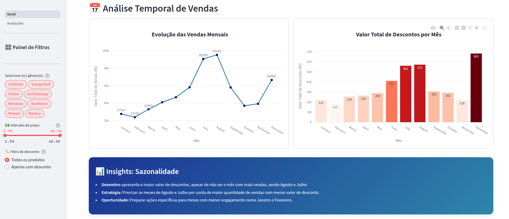

# 📚 Análise de Vendas - Livraria

## [Acesse o Dashboard Online](https://dash-library-marketplace.streamlit.app/)

## Problema de Negócio

A livraria possui um grande volume de dados de vendas, mas enfrenta dificuldades em:

- Entender quais gêneros realmente impulsionam a receita.
- Identificar os melhores períodos para campanhas promocionais.
- Detectar oportunidades em nichos de maior valor com baixa demanda.
- Tomar decisões baseadas em evidências, e não em achismos.

Sem uma análise estruturada, há risco de desperdício de recursos em campanhas ineficazes e baixa eficiência comercial.

## Solução Proposta

Este projeto entrega um dashboard interativo construído com **Streamlit**, que transforma dados brutos de vendas em insights estratégicos, com foco em:

- Gêneros literários mais vendidos e mais lucrativos.
- Sazonalidade e comportamento mensal de vendas e descontos.
- Faixas de preço com maior concentração de vendas.
- Identificação de oportunidades comerciais em segmentos negligenciados.

## Principais Descobertas

### Gêneros Literários
- **Sci-Fi/Fantasy** lidera em número de vendas e receita total.
- **Memoir** e **Nonfiction** têm o maior preço médio, mas volume de vendas baixo — indicando um público de nicho com maior disposição a pagar.

### Sazonalidade
- **Julho e Agosto** são os meses com mais vendas, mesmo com baixos níveis de desconto.
- **Dezembro** possui o maior valor de descontos, mas não o maior volume de vendas — sugerindo ineficiência promocional nesse mês.

### Estratégia de Preço
- A maior parte das vendas está concentrada em livros com preço inferior a **R$ 15**.
- Gêneros com boa performance de receita mesmo com preços acessíveis podem ser alavancados para maximizar lucro.

## Recomendações Estratégicas

- Focar campanhas promocionais em **gêneros com maior retorno financeiro**, como Sci-Fi/Fantasy.
- Criar ações específicas para **nichos premium** (ex: Memoir), com abordagens segmentadas.
- **Aproveitar os meses de alta demanda** com menor custo promocional.
- Reduzir esforços em meses de baixa conversão, como Janeiro e Fevereiro, ou planejar estratégias diferenciadas.

